# Lame HTB

Aujourd'hui, intéressons-nous à une autre machine [HackTheBox](https://www.hackthebox.eu "Le site de Hack The Box") facile créée par **ch4p**, Lame.
Nous avons l'ip (**10.10.10.3**) et l'OS (**Linux**).

Après avoir lancer le même script de découverte de ports utilisé pour [Legacy](https://github.com/gwyomarch/Legacy-HTB-Writeup-FR "Writeup de Legacy"), le scan nous donne le nom de la machine (**lame**), du domaine (**hackthebox.gr**) et du domaine absolu FQDN (**lame.hackthebox.gr**).

Quant aux services, nous en avons plusieurs face à nous qui sont potentiellement exploitables:
- Un serveur de transfère de fichier **VSFTPD (version 2.3.4)** qui autorise les connexions anonymes sur le port 21
- Un service de connexion à distance **OpenSSH** sur le port 22
- Un service de partage de fichiers et de périphériques **Samba (version 3.0.20)** sur les ports 139 et 445
- Et un service de compilation de code **DISTCCD (version 1)** sur le port 3632

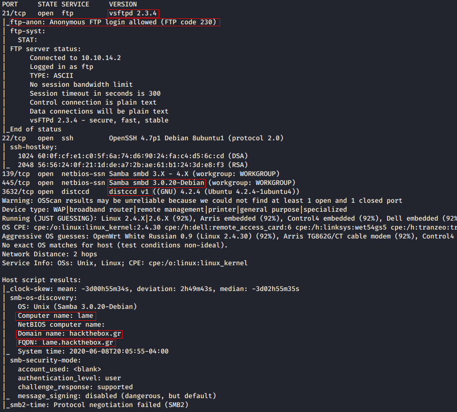

Cherchons des vulnérabilités connues avec NMAP.

Le service **distccd** présente une vulnérabilité qui nous permettra d'attaquer le compte **daemon** qui a probablement des droits limiter sur la machine.
Cherchons d'abord un accès d'administrateur, nous y reviendrons ensuite.

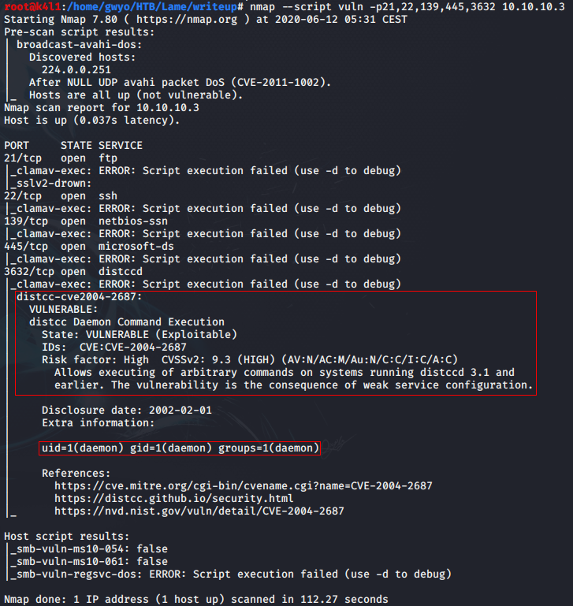

## [VSFTPD 2.3.4](https://www.hackingtutorials.org/metasploit-tutorials/exploiting-vsftpd-metasploitable/)

[VSFTPD](https://security.appspot.com/vsftpd.html) est un service de **File Transfer Protocol (FTP)** qui se veut plus rapide et plus sécurisé.

Nous allons doit vers un "rabbit hole", cependant la version 2.3.4 est connue pour avoir une vulnérabilité assez amusante...

Elle embarque une **backdoor** activable en insérant le smiley "**:)**" dans le nom d'utilisateur.

( exemple: "admin:)" )

Cela ouvre le port 6200 en écoute sur la machine cible pour de l'exécution de commandes à distance.

Voyons ce qu'il y a à voir sur ce serveur FTP en nous connectant en anonyme comme le préconisait notre scanner.

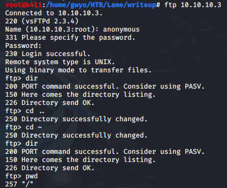

Nous avons accès à un dossier vide et rien d'autre.

Interrogeons la base de données Exploit-DB !

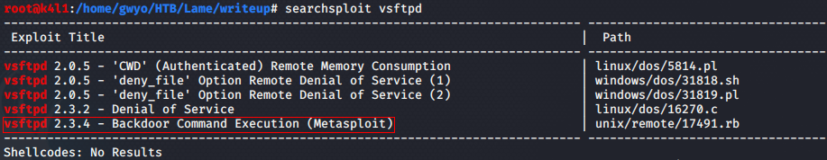

Le Framework Metasploit a un module pour exploiter cette vulnérabilité. Démarrons le service postgres et MSF5.

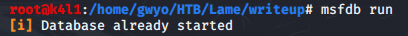

Retrouvons le module en question...

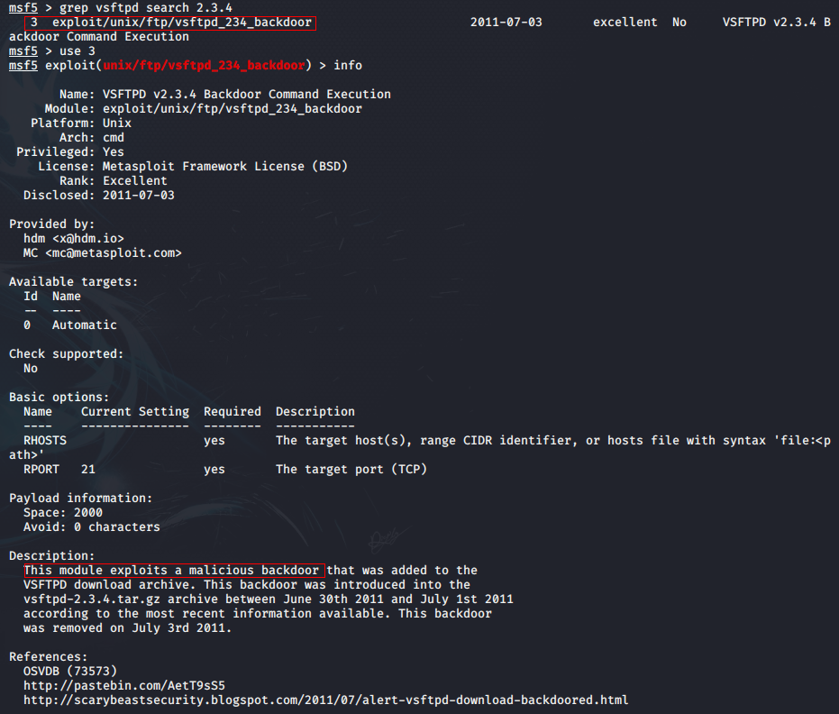

... Lançons-le !

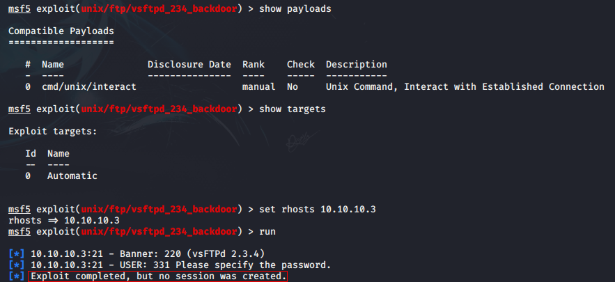

Fausse joie :(

Cherchons d'autres options pour cet exploit, comme un [script python](https://github.com/ahervias77/vsftpd-2.3.4-exploit/blob/master/vsftpd_234_exploit.py) trouvé sur le GitHub de Austin Hervias.

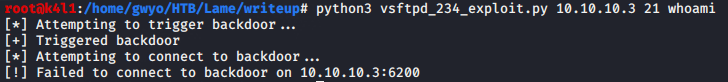

Définitivement, il n'y a aucun lapin dans ce terrier...
Passons au suivant.

## SSH

Pour se connecter à distance via SSH, nous aurons besoin de plus d'information sur les utilisateurs:
- Couples identifiant / mot de passe
- clés RSA 
- ou un moyen d'ajouter notre clé publique dans la configuration de connexion SSH d'un utilisateur sur la machine cible.

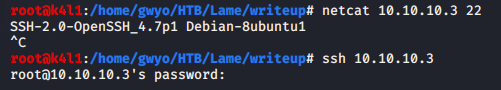

N'ayant rien de tout ça pour le moment, inutile de bruteforce à ce stade.
Nous y reviendrons plus tard.

## Samba 3.0.20 ([CVE-2007-2447](https://www.cvedetails.com/cve/CVE-2007-2447))

Tant que Metasploit Framework est en route, voyons ce qu'il nous propose comme module pour cette version.

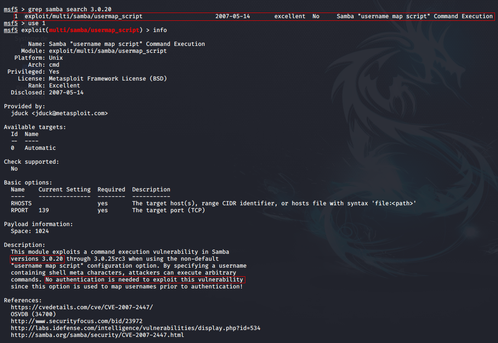

Ce service présente une vulnérabilité qui permet à l'attaquant d'**exécuter des commandes** au moment de l'authentification en insérant dans le nom d'utilisateur des caractères spéciaux et la commande.

**L'exécution passe en priorité sur la vérification.**

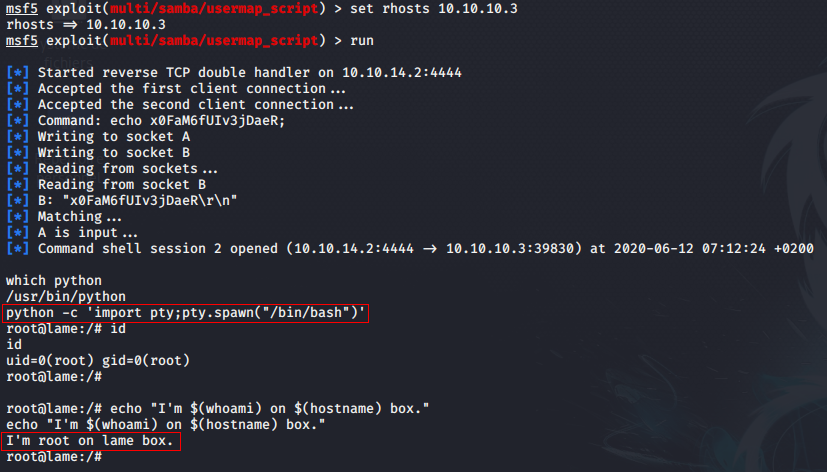

Et nous avons un shell en tant que **root**, que nous pouvons améliorer en [shell TTY](https://netsec.ws/?p=337) ou bien grâce à Metasploit en tapant *shell*.

Regardons dans le détail ce que fait ce module.

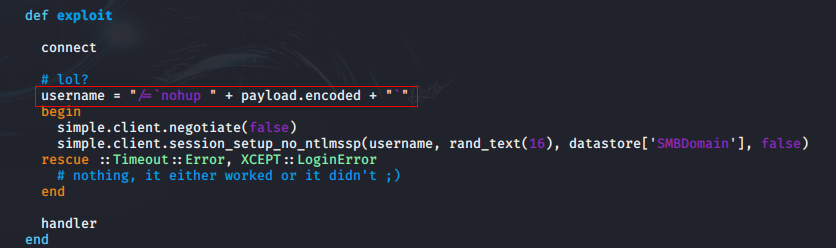

Essayons d'obtenir un shell manuellement. Ouvrons un port en écoute sur la machine attaquante.

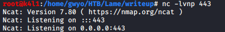

Connectons-nous en anonyme sur le service Samba. Nous avons accès au dossier tmp.

Essayons maintenant d'authentifier un utilisateur avec **./=\`\`** et un payload basique à l'intérieur.

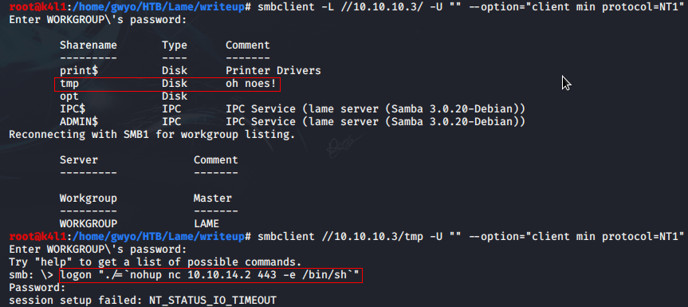

Améliorons notre [shell en TTY](https://medium.com/bugbountywriteup/pimp-my-shell-5-ways-to-upgrade-a-netcat-shell-ecd551a180d2) pour plus de confort avant de passer à la post-exploitation:
- Autocomplétion
- historique des commandes
- commandes (ex: clear, etc...).
- en prévention d'un CTRL + C malencontreux.
- stdin (au cas où nous devrions entrer un mot de passe, par exemple)

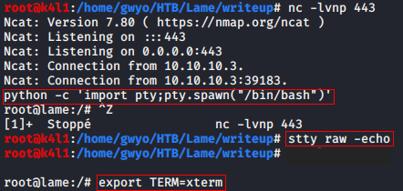

Profitons-en pour fouiller un peu, récupérer les flags...

(Ici, je m'assure juste qu'il s'agit bien des flags (1 ligne de 32 caractères) et d'avoir les droits en lecture dessus.)

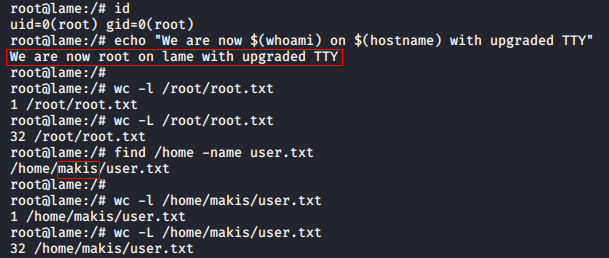

## Post-exploitation

Cherchons à compromettre d'autres comptes. Récupérons les clés SSH...

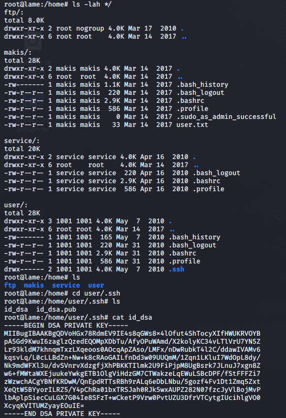

... et les mots de passe hashés en copiant les fichiers **/etc/passwd** et **/etc/shadow**.

Dans ces derniers, les hashes portent la signature **$1$**.
Ce qui signifie qu'ils sont au **format MD5**, un algorithme assez faible.

Nous pouvons donc envisager une attaque bruteforce par dictionnaire pour retrouver les mots de passe.

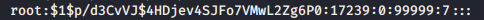

Utilisons **unshadow** et donnons le résultat à John the Ripper qui reconnaît le format **md5crypt**.

En quelques minutes, **4 passwords** sont retrouvés avec le dictionnaire **rockyou.txt**.

Si John fait de la rétention d'information (c'est qu'il a déjà cracké ces hashes auparavant), l'option *--show* sur le fichier permet de les afficher.

Pour information, tout les mots de passe trouvés sont stockés dans le fichier **john.pot**.

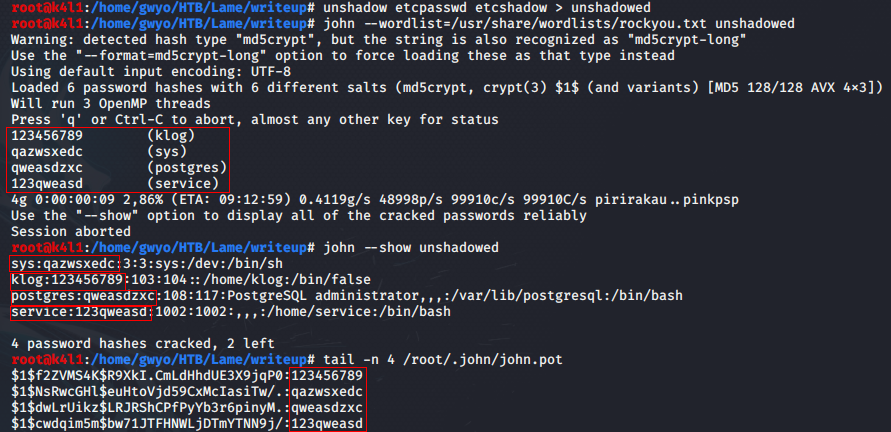

Potentiellement, 4 passwords et 1 clé ssh/dsa à essayer en SSH.

## SSH

La clé ssh trouvée dans le dossier **/home/user/.ssh** semble ne pas avoir de mot de passe mais ne fonctionne pas tel quel.

Elle semble être attribuée à l'utilisateur **user** mais sur une machine nommée "metasploitable".
Mais j'ignore si elle est exploitable ou non sur Lame.

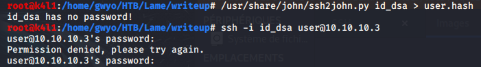

Peu importe, nous avons d'autres pistes...

Tentons de nous connecter en tant que **klog** avec le password **123456789**.
L'absence de répertoire personnel provoque une erreur et bloque la connexion.

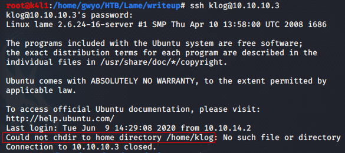

Cependant, les autres utilisateurs dont les mots de passe sont compromis nous ouvrent les bras:
- *user*:	X
- *klog*:	X
- *sys*:	OK!
- *postgres*:	OK!
- *system*:	OK!
- et notre accès *root*.

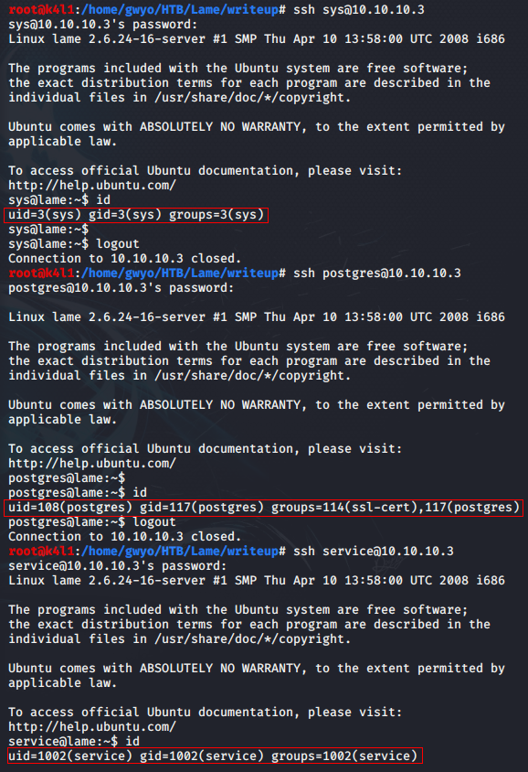

## DistCCD ([CVE-2004-2687](https://www.cvedetails.com/cve/CVE-2004-2687/)) BONUS

Nous avions vu qu'il est possible d'exploiter ce **service de compilation de code** pour exécuter des commande et prendre le contrôle de la cible avec le compte **daemon**.
Utilisons Metasploit pour commencer.

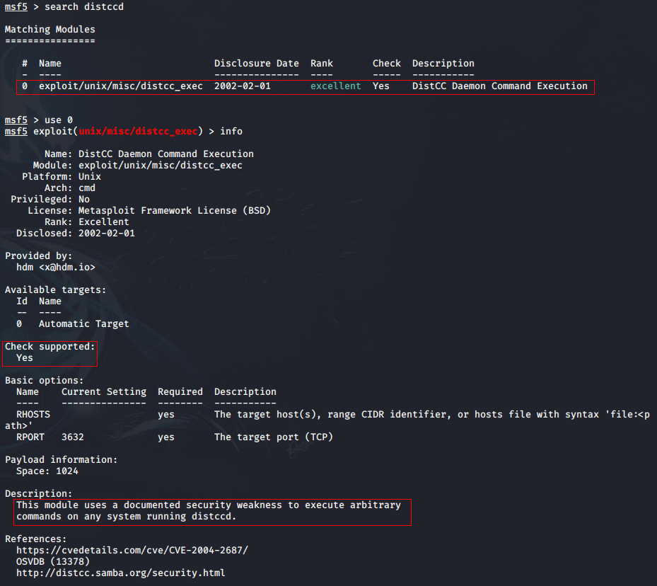

Pas plus d'information sur le fonctionnement du module.
Check, run, shell, et nous sommes daemon.  

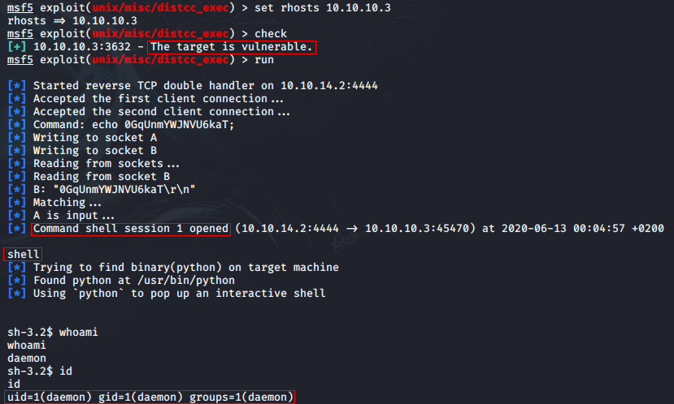
